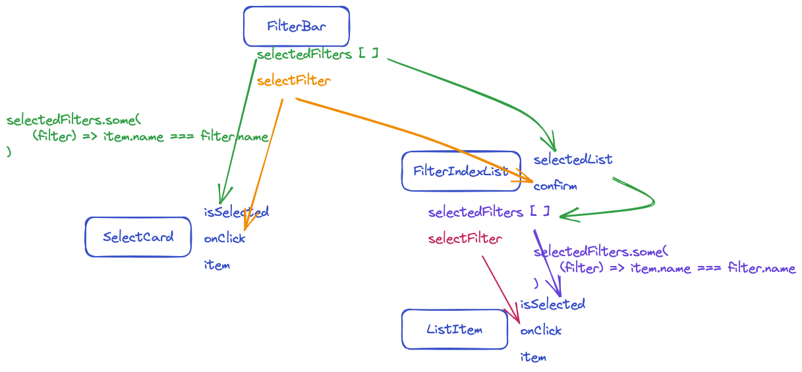

### 如何联动 FilterBar 的 PopupBoard 中的 SelectCard 与 FilterIndexList 中的选项


#### 方案1: 操纵数据

将两个组件所用的数据进行同步，并在数据中添加 `selected: true/false` 的属性用来判断改选项是否被选中

#### 方案2: 组件之间传递属性



##### 从外侧卡片对内侧列表选项通信

当点击切换外层组件 `<FilterBar>` 的子组件 `<SelectCard>` 的选中状态，需要将该状态向同级子组件 `<FilterIndexList>` 的子组件 `ListItem` 传递

`<SelectCard>` => `<FilterBar>` => `<FilterIndexList>` => `<ListItem>`

###### SelectCard => FilterBar

- `<SelectCard>` 中通过属性 `isSelected` 来判断当前是否被选中
- 当点击切换 `<SelectCard>` 时，触发外层组件的 `selectFilter` 函数从而将当前 `<selectCard>` 信息传入外层 state `selectedFilters`

```jsx
const SelectCard = ({ filter, onClick, isSelected }) => {
  // 触发外层传入的 onClick（selectFilter）函数从而将数据传出到外层
	const handleClick = (e) => {
		onClick && onClick(!isSelected, filter)
	}

	return (
		<SelectCardWrapper
      // 通过属性来判断当前是否选中来改变样式
			className={isSelected ? "selected" : ""}
			onClick={handleClick}
		>
      {/* ... */}
		</SelectCardWrapper>
	)
}
```

- 外层组件 `<FilterBar>` 将自己的 `selectFilter` 函数以及传递给 `<SelectCard>`
- 并且通过判断当前 `<SelectCard>` 是否在总数组 `selectedFilters` 中来给 `<SelectCard>` 的 `isSelected` 属性赋值

```jsx
// 父组件
const FilterBar = () => {
	const [selectedFilters, setSelectedFilters] = useState([])	// 存储最终形成的所有 filter
  
  // 改变 selectFilters 的方法
  const selectFilter = (isSelected, filter) => {
		if (isSelected) {
			setSelectedFilters([...selectedFilters, ...filter])
		} else {
			setSelectedFilters(selectedFilters.filter((f) => f.id !== filter.id))
		}
	}

	return (
		<PopupBoard>
			<ul className='search-filters'>
				{dataList.map((filter) => {
					return (
						<li key={filter.key}>
							// ...
							<ul className='content'>
								{filter.filterList.map((f) => {
									return (
										<SelectCard
											key={f.id}
											filter={f}
											onClick={selectFilter}
                      // 使用 some 方法来判断是否在选中的数组中
											isSelected={selectedFilters.some(
												(filter) => f.id === filter.id
											)}
										/>
									)
								})}
							</ul>
						</li>
					)
				})}
			</ul>

			<FilterIndexList
				//...
			/>
		</PopupBoard>
	)
}
```

###### FilterBar => FilterIndexList

- 外层组件 `<FilterBar>` 向子组件 `<FilterIndexList>` 传递选中的 filter 数据的数组 `selectedFilters`
- 外层组件 `<FilterBar>` 向子组件 `<FilterIndexList>` 传递改变 `selectedFilters` 的方法 `selectFilter`
- `<FilterIndexList>` 用属性 `selectedList` 来接受外层 `<FilterBar>` 的总数据 `selectedFilters`

> 当外层总数据 `selectedFilters` 发生改变时，通过 `selectedList` 属性传递给 `<FilterIndexList>`，然后更改其自身的 `selectedFilters` state，然后传递给 `<ListItem>` 来判断是否被选中

```jsx
// 父组件
const FilterBar = () => {
	const [selectedFilters, setSelectedFilters] = useState([])	// 存储最终形成的所有 filter
  // 改变 selectFilters 的方法
  const selectFilter = (isSelected, ...filter) => {
		if (isSelected) {
			setSelectedFilters([...selectedFilters, ...filter])
		} else {
			filter = filter[0]
			setSelectedFilters(selectedFilters.filter((f) => f.id !== filter.id))
		}
	}

	return (
		<PopupBoard>
			<ul className='search-filters'>
				// ...
			</ul>

			<FilterIndexList
				visible={indexListVisible}
				close={() => setIndexListVisible(false)}
				list={filterList}
				confirm={selectFilter}	// 方法
				selectedList={selectedFilters}	// 总数据
			/>
		</PopupBoard>
	)
}
```

###### FilterIndexList => ListItem

- `<FilterIndexList>` 组件中的列表选项 `<ListItem>` 组件设置一个 `selected` state
- `<ListItem>` 添加 `isSelected` 属性
- 通过将 `<ListItem>` 当前数据和外层传入的总数据 `selectedFilters` 中的数据比对，若有匹配，则当前为选中状态，`isSelected` 为 `true`
- 当属性 `isSelected` 改变，即从外部改变了当前列表选项的状态，使用 `useEffect` 改变 `selected` 的 state 值，从而改变选中 / 未选中样式

```jsx
// 子组件
const FilterIndexList = ({ ... }) => {
  // ...
	return (
		<List>
			{list.map((f) => {
				return (
					<ListItem
						key={f.id}
						item={f}
						onClick={select}
						// 筛选外部选中的总数据中有没有和当前项匹配的，若有则当前项为选中状态
						isSelected={selectedList.some((filter) => f.id === filter.id)}
					/>
				)
			})}
		</List>
	)
}

// 子组件中的列表子组件
const ListItem = ({ item, onClick, isSelected }) => {
  const [selected, setSelected] = useState(false)
	// ...

  // 通过外部改变当前项的 selected 值
  useEffect(() => {
    setSelected(isSelected)
  }, [isSelected])

  return (
    <FilterItemWrapper
      className={selected ? "selected" : ""}	// 根据 selected 来改变样式
      onClick={handleClick}
      >
      {/* ... */}
    </FilterItemWrapper>
  )
}
```

##### 从内层列表对外层卡片通信

当点击切换内层组件 `<FilterIndexList>` 的子组件 `<ListItem>` 的选中状态，需要将该状态向外传递，并且在外层 `<FilterIndexList>` 集合所有选中的数据，再通过 `confirm` 方法向外层 `<FilterBar>` 组件传递，更新总的 `selectedFilters` 的值，然后传给其子组件 `<SelectCard>` 来更新选中 / 未选中样式

###### ListItem => FilterIndexList

- 当改变 `<ListItem>` 的 `selected` 的 state 值，会通过外层传入的  `onClick` 函数改变外层总的 state `selectedFilters`

```jsx
// 子组件中的列表子组件
const ListItem = ({ item, onClick, isSelected }) => {
  const [selected, setSelected] = useState(false)
  // 更改自身 selected 的同时向外部传入当前项
	const handleClick = () => {
		const nextSelected = !selected
		setSelected(nextSelected)
		onClick &&
			onClick(nextSelected, { ...item, cancel: () => setSelected(false) })
	}

  // 通过外部改变当前项的 selected 值
  useEffect(() => {
    setSelected(isSelected)
  }, [isSelected])

  return (
    <FilterItemWrapper
      className={selected ? "selected" : ""}	// 根据 selected 来改变样式
      onClick={handleClick}
      >
      {/* ... */}
    </FilterItemWrapper>
  )
}
```

###### FilterIndexList => FilterBar

- `<FIlterIndexList>` 需要创建一个自身的 `selectedFilters` state，用来保存选中的 `<ListItem>`
- 需要创建一个自身的 `handleSelect` 来选择 `<ListItem>`
- 接收一个 `comfirm` 函数，用来给外层组件 `<FilterBar>` 传递最终整合好的 filters 数组

```jsx
const FilterIndexList = ({
	visible,
	list = [],
	filterType,
	close,
	confirm,
	selectedList = [],
}) => {
  // 自身的 selectedFilters, 用来和 ListItem 联动
	const [selectedFilters, setSelectedFilters] = useState(selectedList)
	// 自身的用来选择 ListItem 的函数
	const handleSelect = (isSelected, filterItem) => {
		if (isSelected) {
			setSelectedFilters([...selectedFilters, filterItem])
		} else {
			setSelectedFilters(selectedFilters.filter((f) => f.id !== filterItem.id))
		}
	}
	// 调用外部传入的函数将最种的选择数据传出
	const handelConfirm = () => {
		confirm(selectedFilters)
    // ...
	}

  // 一旦外部总数据改变，这里的子数据也改变
	useEffect(() => {
		setSelectedFilters(selectedList)
	}, [selectedList])

	return (
		<List>
			{list.map((f) => {
				return (
					<ListItem
						key={f.id}
						item={f}
						onClick={select}
						// 筛选外部选中的总数据中有没有和当前项匹配的，若有则当前项为选中状态
						isSelected={selectedFilters.some((filter) => f.id === filter.id)}
					/>
				)
			})}
      <button onClick={handelConfirm}>confirm</button>
		</List>
	)
}
```

- `<FilterBar>` 声明一个 `confirmFilterIndexList` 函数用来传给 `<FilterIndexList>` 的 `confirm` 属性

```jsx
// FilterBar component
const confirmFilterIndexList = (indexFilters) => {
  // 拿到当前 selectedFilters 中不属于 FilterIndexList 的选项
  const otherFilters = selectedFilters.filter(
    (f) => f.parentKey !== currentAllFiltersType.key
  )
  // 将非 FilterIndexList 的选项和传出的 FilterIndexList 的选项合并，成为新的 selectedFilters
  setSelectedFilters([...otherFilters, ...indexFilters])
}

//... 
<FilterIndexList
  // ...
  confirm={confirmFilterIndexList}
  selectedList={selectedFilters.filter(
    (f) => f.parentKey === currentAllFiltersType.key
  )}
/>
```

###### FilterBar => SelectCard

- `<SelectCard>` 和 `<ListItem>` 一样，传入一个属性 `isSelected`
- 在外部通过与总数据 `selectedFilters` 进行对比，从而改变 `isSelected` 属性进而改变内部的 `selected` state 值

```jsx
const FilterBar = () => {
	// ...
	return (
		<PopupBoard>
			<ul className='search-filters'>
				{dataList.map((filter) => {
					return (
						<li key={filter.key}>
							<section className='title'>{/* ... */}</section>
							<ul className='content'>
								{filter.filterList.map((f) => {
									return (
										<SelectCard
											key={f.id}
											filter={f}
											onClick={selectFilter}
                      // ListItem 改变了 selectedFilters，通过比对改变 isSelected 属性
											isSelected={selectedFilters.some(
												(filter) => f.id === filter.id
											)}
										/>
									)
								})}
							</ul>
						</li>
					)
				})}
			</ul>
	)
}
```

```jsx
const SelectCard = ({ filter, onClick, isSelected }) => {
	const [selected, setSelected] = useState(false)
	// ...
  
  // 当 isSelected 属性改变，改变自身的 selected 属性
	useEffect(() => {
		setSelected(isSelected)
	}, [isSelected])

	return (
		<SelectCardWrapper
			className={selected ? "selected" : ""}
			onClick={handleClick}
		>
      {/* ... */}
		</SelectCardWrapper>
	)
}
```


